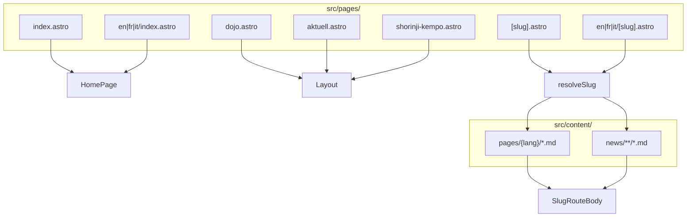

# Astro developer guide — Shorinji Kempo site

Onboarding doc for developers new to this repository. Everything below reflects the **current codebase** (static Astro site, GitHub Pages deploy).

---

## 1. How Astro works here

### Static site generation

This project is a **fully static** Astro site. There is no server runtime in production.

| Command | Purpose |
|--------|---------|
| `npm run dev` | Local dev server (`astro dev`) |
| `npm run build` | Output to `dist/` (`astro build`) |
| `npm run preview` | Serve `dist/` locally after a build |

Node **≥ 22.12** is required (`package.json` `engines`).

### GitHub Pages base path (`base` / `SITE_BASE`)

The live site is published at:

`https://armandfrigo.github.io/shorinji-kempo/`

Configuration lives in `astro.config.mjs`:

- **`site`**: `https://armandfrigo.github.io`
- **`base`**: subpath for production builds (default `/shorinji-kempo`, overridable via env)
- **`SITE_BASE`**: read at config load time; normalized by `normalizeBase()` (leading slash, no trailing slash)

**Dev vs prod base** (important):

```js
const astroSubcommand = process.argv[2];
const base = astroSubcommand === 'dev' ? '/' : deployBase;
```

| Mode | `import.meta.env.BASE_URL` | Example home URL |
|------|----------------------------|------------------|
| `npm run dev` | `/` | `http://localhost:4321/` |
| `npm run build` / CI | `/shorinji-kempo` (unless `SITE_BASE` set) | `https://armandfrigo.github.io/shorinji-kempo/` |

CI sets `SITE_BASE: /shorinji-kempo` in `.github/workflows/deploy.yml` before `npm run build`.

Always use **`withBase()`** from `src/utils/paths.ts` for root-relative links and assets in components, so they work in both dev and production.

### Built-in i18n routing

`astro.config.mjs` enables Astro i18n:

- **Default locale**: `de` (no URL prefix — `prefixDefaultLocale: false`)
- **Other locales**: `fr`, `en`, `it` under `/{lang}/...`
- **Fallback** (Astro-level): `fr`, `en`, `it` → `de` for missing UI strings only; **content** for prefixed routes does **not** fall back to German markdown (see `resolveSlugPage`).

### Markdown pipeline

- **Markdoc** integration: `@astrojs/markdoc`
- **Rehype**: `rehype-internal-links.mjs` rewrites `href` / `src` / `srcset` in rendered markdown so internal paths get the deploy `base`, and legacy WordPress upload URLs map to `/uploads/...`.

### Import scripts (content maintenance, not runtime)

| Script | Role |
|--------|------|
| `npm run import:static` | WP static asset import (`scripts/import-static-wp.mjs`) |
| `npm run import:pages` | HTML → markdown into `src/content/pages/` (`scripts/import-static-pages.mjs`) |

Re-running `import:pages` **overwrites** `fr` / `en` / `it` page bodies with text converted from the **German** WP HTML unless you skip or edit those files afterward.

---

## 2. Key pages and routing

Astro maps **`src/pages/**` → URLs**. File path = route (plus `base` in production).

### Locale home pages

| File | URL (DE, no prefix) | URL (other langs) |
|------|---------------------|-------------------|
| `src/pages/index.astro` | `/` | — |
| `src/pages/en/index.astro` | — | `/en/` |
| `src/pages/fr/index.astro` | — | `/fr/` |
| `src/pages/it/index.astro` | — | `/it/` |

Each home page wraps `HomePage.astro` in `Layout.astro` and passes `lang` + copy from `src/i18n/homePage.ts`.

### Dynamic slug routes (content collections)

| File | URL pattern |
|------|-------------|
| `src/pages/[slug].astro` | `/{slug}` (DE) |
| `src/pages/en/[slug].astro` | `/en/{slug}` |
| `src/pages/fr/[slug].astro` | `/fr/{slug}` |
| `src/pages/it/[slug].astro` | `/it/{slug}` |

**`getStaticPaths`** (`src/lib/get-slug-static-paths.ts`):

- Collects all `routeSlug` values from **`pages`** collection
- Collects all `wpSlug` (or entry slug) from **`news`** collection
- Builds one path per unique slug (shared across locales; locale is fixed by which `[slug].astro` file handles the request)

**Resolution** (`src/lib/get-slug-page-data.ts` → `resolveSlugPage`):

1. Prefer **`pages`** entry where `data.routeSlug === slug` **and** `data.lang === lang`
2. Else **`news`** entry where `data.lang === lang` and `data.wpSlug === slug`
3. If neither exists → redirect to home (`withBase('/')`)

Rendered via `SlugRouteBody.astro` (site page vs news article layout).

**Examples — what generates which URL**

| URL (DE, dev) | Source |
|---------------|--------|
| `/faq` | `[slug].astro` + `src/content/pages/de/faq.md` (`routeSlug: faq`) |
| `/basel` | `[slug].astro` + `src/content/pages/de/basel.md` |
| `/philosophie` | `[slug].astro` + `src/content/pages/de/philosophie-modern-de.md` |
| `/links` | `[slug].astro` + `src/content/pages/de/links.md` |
| `/schwarzgurttrainings-2026` | `[slug].astro` + `src/content/news/de/schwarzgurttrainings-2026.md` (`wpSlug`) |
| `/en/faq` | `en/[slug].astro` + `src/content/pages/en/faq.md` |

There are **no** dedicated `faq.astro` or `links.astro` route files in the current tree; FAQ and Links are slug-driven content pages.

### Dedicated `.astro` routes (not from collections)

| File(s) | URL | Notes |
|---------|-----|--------|
| `dojo.astro`, `en/dojo.astro`, `fr/dojo.astro`, `it/dojo.astro` | `/dojo`, `/en/dojo`, … | Hardcoded dojo overview (Basel / Aubonne / Muri cards). Skipped by page import script. |
| `aktuell.astro`, `*/aktuell.astro` | `/aktuell`, `/en/aktuell`, … | News **hub**: lists `news` collection + `InstagramNewsCarousel`. |
| `shorinji-kempo.astro`, `*/shorinji-kempo.astro` | `/shorinji-kempo`, … | Hardcoded “Philosophy / six characteristics” page (duplicate topic with `/philosophie` markdown — see content note below). |

`import-static-pages.mjs` **skips** importing WP HTML for: `dojo`, `links`, `aktuell`, `blog`, `shorinji-kempo`, `startseite`.

### Routing diagram (simplified)



### Legacy / stray files under `src/pages/`

Some `*.md` files still sit next to `.astro` files (e.g. `faq-de.md`, `*-modern-de.md`, roadmap docs). **Routes in use** are the `.astro` files and content collections above. Treat orphan `.md` in `src/pages/` as migration leftovers unless you confirm Astro is building them.

---

## 3. `public/` vs `src/assets/` for images

### `public/` — default for this site

Files in `public/` are copied **as-is** to the site root (then under `base` in production).

- **`public/uploads/...`**: bulk of media from WordPress import. Markdown and HTML often reference `/uploads/2019/09/...`.
- **`public/images/...`**: favicons, hero duplicate, misc.
- **`public/favicon.ico`**

In components and frontmatter, reference them with **root-relative paths** and **`withBase()`**:

```astro

```

**Why uploads live here**

1. Thousands of migrated files; no build-time processing needed.
2. Markdown bodies keep stable URLs (`/uploads/...`); `rehype-internal-links.mjs` normalizes old `wp-content/uploads` paths and prefixes `base` on build.
3. News `image` frontmatter uses paths like `/images/ATT45591.jpg` or `/uploads/...` — same pattern.

### `src/assets/` — Astro-optimized imports

Only **`src/assets/images/IMAG0395-1.jpg`** exists today (hero source file).

`HomePage.astro` currently:

```astro
import { Image } from 'astro:assets';
import heroImage from '../assets/images/IMAG0395-1.jpg';
// ...
<HeroPremium imageUrl={withBase('/images/IMAG0395-1.jpg')} ... />
```

`HeroPremium.astro` renders a plain ``. The **`heroImage` import is not wired to `<Image>` yet**; the live hero uses the **public** copy at `public/images/IMAG0395-1.jpg`.

| Use | Pattern |
|-----|---------|
| Markdown, many static images, dojo cards, navbar logo | `public/` + `withBase('/uploads/...')` |
| New hero/LCP image where you want WebP, widths, `srcset` | `import` from `src/assets/` + `astro:assets` `<Image />` |
| Same file in both places | Avoid drift — prefer one source; today hero exists in both `src/assets` and `public/images` |

**Rule of thumb**: if the URL must appear unchanged in markdown or there are many legacy paths → **`public/`**. If the image is referenced only from `.astro` and you want optimization → **`src/assets/`** + `<Image>`.

---

## 4. Components vs content vs pages

| Layer | Location | Responsibility |
|-------|----------|----------------|
| **Pages** | `src/pages/*.astro` | URL entry points, `getStaticPaths`, thin wrappers |
| **Components** | `src/components/` | Reusable UI |
| **Content** | `src/content/pages/`, `src/content/news/` | Markdown + frontmatter, schemas in `src/content.config.ts` |
| **Layout** | `src/layouts/Layout.astro` | Shell: `<html>`, Navbar, Footer, global CSS |
| **i18n strings** | `src/i18n/ui.ts`, `src/i18n/homePage.ts` | Short translated UI copy |
| **Libs** | `src/lib/` | Slug path helpers, shared page logic |

### Important components

| Component | Role |
|-----------|------|
| `navbar.astro` | Nav, dropdowns, language switcher, `ui` labels, `withBase` / locale paths |
| `HomePage.astro` | Home sections (hero, philosophy teaser, dojos, FAQ preview, CTA, contact) |
| `HeroPremium.astro` | Home hero layout |
| `SlugRouteBody.astro` | Wrapper for markdown-driven site pages vs news posts |
| `Footer.astro` / `FooterSocial.astro` | Footer blocks and social links |
| `DojoCard.astro`, `ContactForm.astro`, `InstagramNewsCarousel.astro` | Home / news features |

### Content collections (`src/content.config.ts`)

**`pages`** — site pages (about, dojos detail, FAQ, links, …)

```yaml
---
lang: de
routeSlug: basel
title: Dojo Basel
---
```

**`news`** — blog / Aktuell articles

```yaml
---
lang: de
wpSlug: schwarzgurttrainings-2026
title: Schwarzgurttrainings 2026
date: 2025-11-03
image: /images/ATT45591.jpg
---
```

Loader: `glob` over `src/content/pages` and `src/content/news` (see `content.config.ts`).

---

## 5. Layout, styles, utils

| File | Role |
|------|------|
| `src/layouts/Layout.astro` | Page shell, favicons via `withBase`, optional title/description, imports `global.css`, renders `Navbar` + `<slot />` + `Footer` |
| `src/styles/global.css` | Design tokens (colors, typography), utilities, shared section styles |
| `src/utils/paths.ts` | **`withBase(path)`** — prefix `import.meta.env.BASE_URL`; **`localizePath(path, lang)`** — DE unprefixed, others `/{lang}/...`; **`stripBaseFromPath`** — for nav active-state logic |
| `rehype-internal-links.mjs` | Post-process markdown HTML: WP upload URL normalization + base prefix on internal links/images |

Navbar duplicates a small `localizePath` helper inline (same rules as `paths.ts` for consistency with `currentPath`).

---

## 6. i18n: `ui.ts` / `homePage.ts` AND translated markdown

Two complementary systems — not redundant by accident.

### TypeScript dictionaries (UI chrome)

| File | Used for |
|------|----------|
| `src/i18n/ui.ts` | Navbar, footer, news hub meta, carousel strings, section labels |
| `src/i18n/homePage.ts` | Home hero, philosophy teaser, dojo cards on home, FAQ preview, CTA |

Consumed directly in `.astro` components (`ui[lang]`, `homeCopy[lang]`). **One place** to change a nav label or home hero title across the component tree.

### Markdown per locale (long-form body)

| Path | Used for |
|------|----------|
| `src/content/pages/{de,en,fr,it}/*.md` | Full page prose: FAQ answers, Basel dojo detail, Entstehung, etc. |
| `src/content/news/**` | News articles per `lang` |

Rendered through `[slug].astro` + `SlugRouteBody`. **Edit the file for the locale** you care about; `resolveSlugPage` does not fall back to German for `/fr/...` routes.

### Why both exist (history)

1. **WordPress import** (`import:pages`, `import:static`) brought HTML → markdown and images under `public/uploads/`.
2. The import script writes the **same German-derived body** into all four `lang` folders unless you translate manually afterward (`import-static-pages.mjs` comment).
3. **New 2026 UI** (home, nav, dojo overview `.astro`, `shorinji-kempo.astro`) uses TypeScript i18n for short, hand-maintained strings.
4. Some topics exist in **two forms** (e.g. `/shorinji-kempo` hardcoded `.astro` vs `/philosophie` from markdown) from migration vs redesign — prefer one canonical URL when editing.

### When to edit what

| Change | Edit |
|--------|------|
| Nav label “Aktuell” | `src/i18n/ui.ts` |
| Home hero subtitle | `src/i18n/homePage.ts` |
| Full FAQ answer on `/faq` | `src/content/pages/{lang}/faq.md` |
| News article body | `src/content/news/...` |
| Dojo overview cards on `/dojo` | `src/pages/dojo.astro` (and `en`/`fr`/`it` copies) |
| Basel dojo detail page | `src/content/pages/{lang}/basel.md` |

---

## 7. Where do I change X?

| I want to change… | File(s) |
|-------------------|---------|
| **Nav label** (menu item text) | `src/i18n/ui.ts` → key like `nav.faq`, `nav.dojoBasel` |
| **Nav link target** (path) | `src/components/navbar.astro` → `aboutMenuItems`, `dojoMenuItems`, or hardcoded `localizePath('/...')` |
| **Home hero** title / subtitle / CTA | `src/i18n/homePage.ts` → `homeCopy[lang].hero` |
| **Home hero image** | `public/images/IMAG0395-1.jpg` and/or wire `src/assets/images/IMAG0395-1.jpg` in `HomePage.astro` / `HeroPremium.astro` |
| **Home dojo cards** (teaser) | `src/i18n/homePage.ts` → `homeDojos` |
| **Dojo overview page** (`/dojo`) | `src/pages/dojo.astro` (+ `en`/`fr`/`it/dojo.astro`) |
| **Single dojo detail** (Basel, etc.) | `src/content/pages/{lang}/basel.md` (etc.) |
| **FAQ full page** | `src/content/pages/{lang}/faq.md` |
| **FAQ teaser on home** | `src/i18n/homePage.ts` → `faqPreview` |
| **News list / Aktuell hub** | `src/pages/aktuell.astro` (+ locale variants); strings in `ui.ts` |
| **One news post** | `src/content/news/...` |
| **Footer contact / legal labels** | `src/i18n/ui.ts`; external URLs in `src/components/Footer.astro` |
| **Footer social link row** | `src/components/FooterSocial.astro` |
| **Philosophy long page (markdown)** | `src/content/pages/{lang}/philosophie-modern-*.md` |
| **Philosophy “six pillars” static page** | `src/pages/shorinji-kempo.astro` (+ locale files) |
| **Deploy URL prefix** | `SITE_BASE` env / `astro.config.mjs`; links must use `withBase` |
| **Internal links in markdown** | Paths in `.md`; plugin `rehype-internal-links.mjs` |

---

## Quick reference: project layout

```
astro.config.mjs          # site, base, i18n, markdown rehype
rehype-internal-links.mjs
src/
  pages/                # routes (.astro)
  content/
    pages/{lang}/       # site markdown
    news/               # articles
  components/
  layouts/Layout.astro
  i18n/ui.ts, homePage.ts
  utils/paths.ts
  lib/get-slug-*.ts
  styles/global.css
  assets/images/        # optimizable imports (minimal today)
public/
  uploads/              # main image store
  images/
dist/                   # build output (gitignored in normal workflow)
```

---

## Related docs

- `Documentation/README.md` — repo overview  
- `Documentation/WINDOWS-SETUP.md` — local environment on Windows  

For content import behavior, see comments at the top of `scripts/import-static-pages.mjs` and `src/content.config.ts`.
